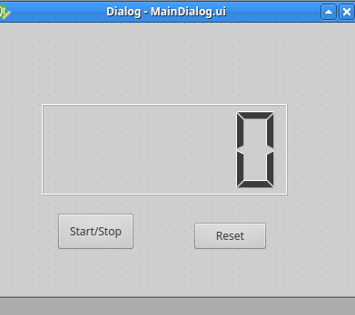

ramenn
=====

# Description
ラーメンタイマー
# Requirement
- Python 2.7.x
- PySide

# Usage
##　アプリの起動
'$ python main.py'

#Install
以下のコマンドで任意のディレクトリにcloneしてください。
'$ git clone git@github.com:Hayasakikazunori/ramenn.git
または任意のディレクトリにzipファイルをダウンロードして解凍してください。

# Author
[Hayasakikazunori](https://github.com/Hayasakikazunori)